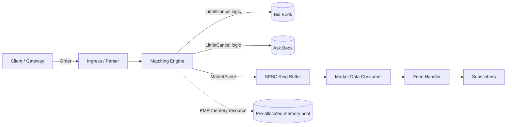
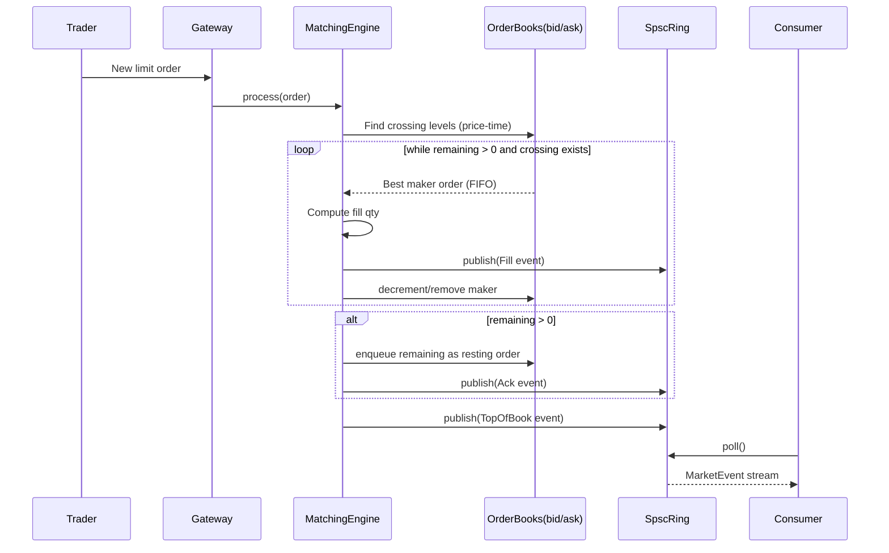
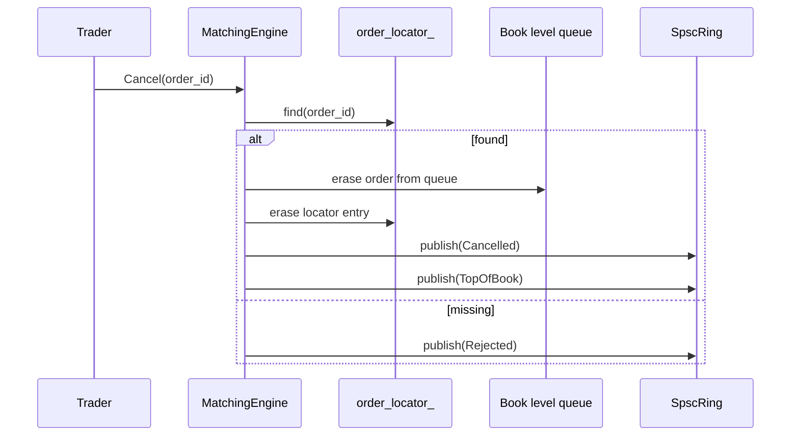
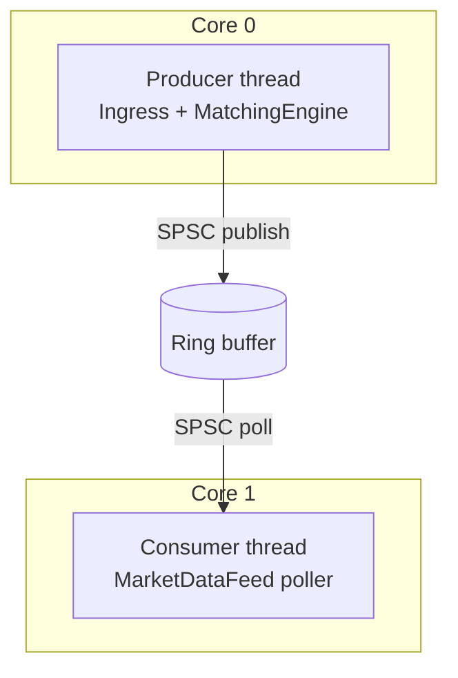
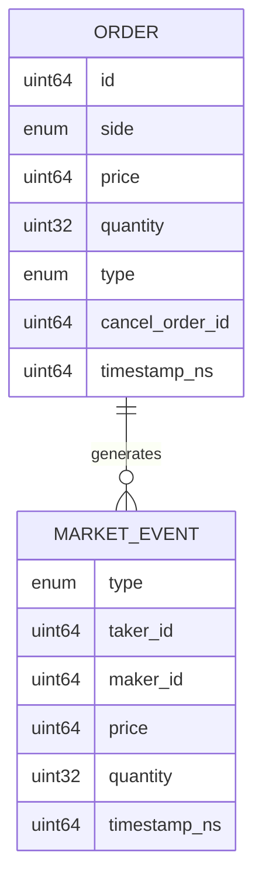

# Canyon Exchange — Full System Visualization

This page provides a complete, end-to-end view of how Canyon Exchange processes orders and emits market data.

> GitHub supports Mermaid rendering directly in Markdown. Open this file on GitHub to view the diagrams.

---

## 1) End-to-end component flow

---

## 2) Sequence of a limit order that matches

---

## 3) Cancel path sequence

---

## 4) Runtime threading model

---

## 5) Data model snapshot

---

## How to use this visualization

1. Start with **component flow** to understand system boundaries.
2. Read **limit-order sequence** and **cancel sequence** for control flow.
3. Use **threading model** to reason about low-latency behavior.
4. Cross-reference implementation files:
   - `include/canyon/matching_engine.hpp`
   - `src/matching_engine.cpp`
   - `include/canyon/spsc_ring.hpp`
   - `src/main.cpp`
